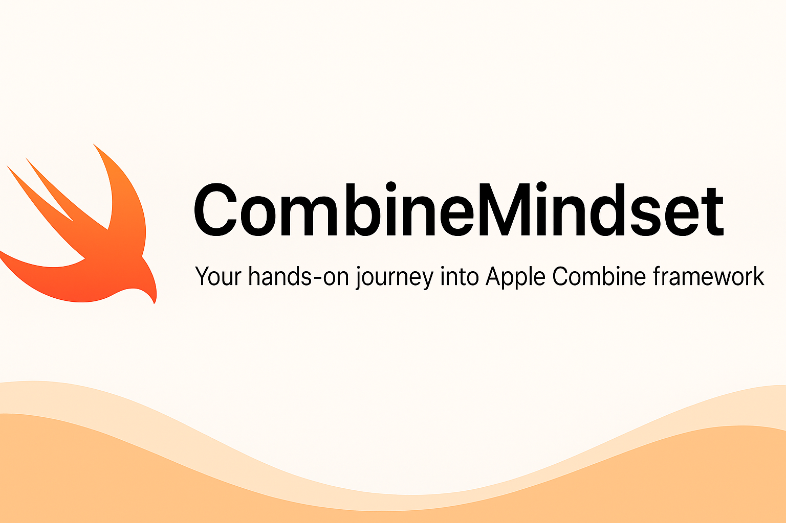

# 🚀 CombineMindset

A hands-on learning project to explore and master Apple's **Combine** framework using real-world examples and MVVM architecture.

---

## 🧠 About This Project

**CombineMindset** is a Swift-based educational project structured as a progressive learning path through Combine.  
It covers the fundamentals, operator usage, MVVM architecture integration, and networking with `URLSession`.

The goal is to develop a solid mindset and fluency when working with Combine in production iOS apps.

---

## 📚 Learning Stages

The project follows a 4-stage plan:

1. **Combine Basics** – Publishers, Subscribers, Subjects
2. **Combine Operators** – map, filter, debounce, combineLatest, etc.
3. **MVVM Integration** – `@Published`, `PassthroughSubject`, `ObservableObject`
4. **Networking with Combine** – `URLSession`, `catch`, `retry`, and more

Each stage includes demo examples and hands-on coding challenges.

---

## 🧪 Technologies

- Swift
- SwiftUI
- Combine
- MVVM Architecture

---

## 🚧 Project Status

✅ Stage 1 – Basics  
🔜 Stage 2 – Operators  
🔜 Stage 3 – MVVM  
🔜 Stage 4 – Networking

---

## 📦 How to Run

1. Open CombineMindset.xcodeproj
2. Run the project in the simulator
